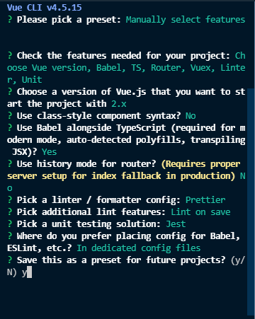

## vue 설정
[Vue.js 개발 생산성을 높여주는 도구 3가지](https://joshua1988.github.io/web-development/vuejs/boost-productivity/)

## setting


## vue update
```
npm update -g @vue/cli
```

## vue.js [Options API] vs [Composition API]

## TypeScript [Class API] vs [Composition API]
- vue RFC(Request for Comment) : class api 제안을 drop함 ->  Composition API
- class 대신 setup옵션을 통한 composition api를 지향함(vue 3) - angular 랑비슷


## Composition API 
- 향상된 DOM접근
- TypeScript 적용에 용이
- 목적에 맞는 코드를 모듈화하여 진행
- 유연하고 안전한 확장 가능
